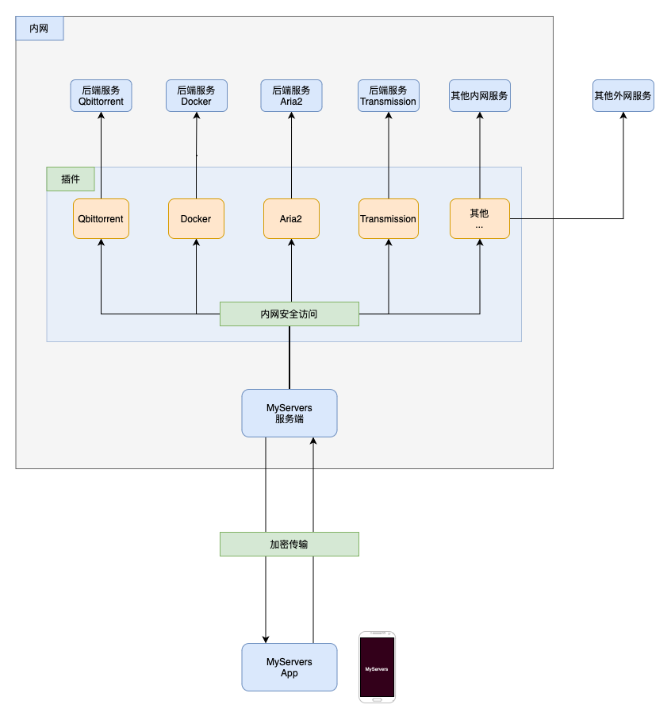

# MyServers

一个App监控管理你所有的服务器和服务端应用。这是一款监控管理App，可以扩展各种服务端插件，十分灵活。

## 特性
- 监控管理服务器，应用
- 插件化，可扩展性十分强大
- 持续支持各种插件的开发
- 所有数据加密传输，保证安全
- 丰富的UI

## 整体架构

### 客户端
- [App Store](https://apps.apple.com/app/myservers/id6466196656)

## 安装
### 服务端

- 推荐在app上通过SSH一键**安装**
- 也可以手动安装，[快速开始](https://myservers.codeloverme.cn/doc/)

## 开发自己的插件
[文档](https://doc.myservers.codeloverme.cn/docs/intro/)

## 意见和建议
- 欢迎[提出意见](mailto:codeloverql@gmail.com)，也欢迎贡献插件，如果没有技术能力，欢迎提出需要的插件，我们持续支持
